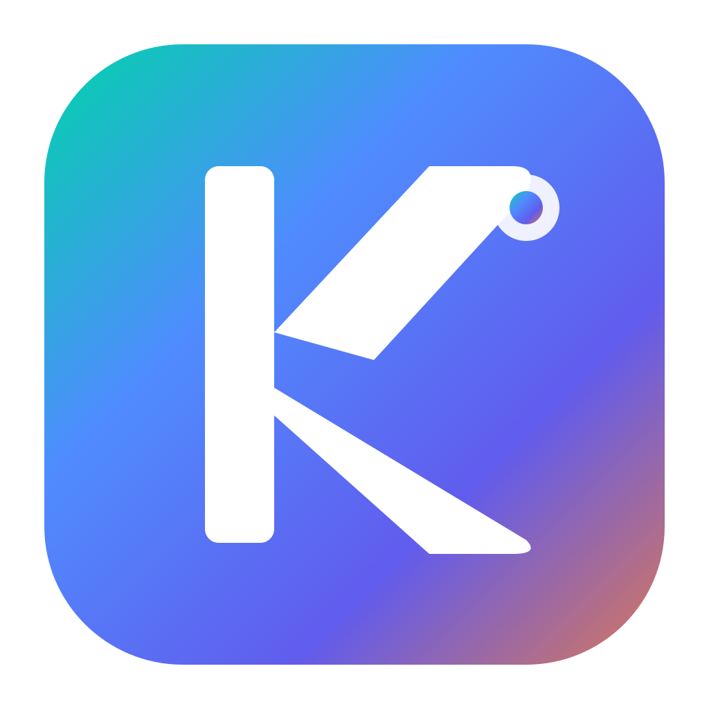

# KaiChatHub

<p align="center">
  
</p>

<p align="center">
  <strong>一站式 AI 大模型聊天应用</strong><br>
  将多个主流 AI 助手网页版整合到一个桌面应用中，让你轻松切换、高效对话
</p>

<p align="center">
  
  
  
  
</p>

## 支持的 AI 模型

| 序号 | AI 模型 | 网址 | 需要代理 |
|:----:|---------|------|:--------:|
| 1 | 🟢 **腾讯元宝** | https://yuanbao.tencent.com/ | ❌ |
| 2 | 🔵 **文心一言** | https://yiyan.baidu.com/ | ❌ |
| 3 | 🩵 **字节豆包** | https://www.doubao.com/ | ❌ |
| 4 | 🔷 **深度求索 DeepSeek** | https://chat.deepseek.com/ | ❌ |
| 5 | 🌙 **月之暗面 Kimi** | https://www.kimi.com/ | ❌ |
| 6 | 🟣 **通义千问** | https://www.qianwen.com/ | ❌ |
| 7 | 🌿 **ChatGPT** | https://chatgpt.com/ | ✅ |
| 8 | ✨ **Google Gemini** | https://gemini.google.com/ | ✅ |
| 9 | 🧡 **Anthropic Claude** | https://claude.ai/ | ✅ |
| 10 | 🟪 **xAI Grok** | https://grok.com/ | ✅ |

## 特性

- 🎨 **现代化界面** - 精心设计的深色主题，沉浸式体验
- ⚡ **快速切换** - 侧边栏一键切换不同 AI 模型
- 🗂️ **页面管理** - 可在设置中启用或隐藏平台入口，自定义侧边栏
- 🔒 **独立会话** - 各平台登录状态互不影响，数据隔离
- 🧹 **数据清理** - 支持单独清除指定平台的 Cookie、缓存和登录状态
- 🌐 **代理支持** - 内置代理设置与连通性测试，支持 HTTP/SOCKS5/SOCKS4
- 🛡️ **兼容优化** - 针对不同平台做登录与浏览器环境适配
- 💾 **状态记忆** - 记住上次使用的标签页，重新启动后自动恢复
- ⌨️ **快捷键** - 支持键盘快捷操作，提升效率
- 🖥️ **跨平台** - 支持 macOS、Windows、Linux

## 快速开始

### 下载安装

前往 [Releases](../../releases) 页面下载对应平台的安装包：

- **macOS**: `KaiChatHub-x.x.x-arm64.dmg` (Apple Silicon) 
- **Windows**: `KaiChatHub-x.x.x.exe`
- **Linux**: `KaiChatHub-x.x.x.AppImage`

### 从源码运行

```bash
# 克隆仓库
git clone https://github.com/kuanghy/KaiChatHub.git
cd KaiChatHub

# 安装依赖
npm install

# 运行应用
npm start
```

### 打包构建

```bash
# macOS
npm run build:mac

# Windows
npm run build:win

# Linux
npm run build:linux
```

## 使用说明

### 首次使用

- 启动应用后，默认会显示常用平台入口
- 点击侧边栏图标即可切换不同 AI 页面
- 每个平台使用独立 `session`，登录状态互不影响

### 页面管理

- 点击左下角设置按钮可打开设置面板
- 可以按需启用或隐藏平台入口，精简侧边栏
- 至少会保留一个已启用页面，避免误操作后无页面可用

### 代理使用

- 对于需要代理访问的 AI 模型（ChatGPT、Gemini、Claude、Grok），点击左下角设置图标配置代理
- 支持 `HTTP`、`SOCKS5`、`SOCKS4` 代理
- 保存前可先使用“测试连接”确认代理是否可用

### 数据清理

- 在设置面板的页面管理区域，可单独清除某个平台的数据
- 清除后会移除该平台的 Cookie、缓存和登录状态
- 适合处理登录异常、缓存污染或切换账号场景

## 快捷键

| 快捷键 | 功能 |
|--------|------|
| `Cmd/Ctrl + R` | 刷新当前页面 |
| `Escape` | 关闭设置面板 |

## 代理设置

- **HTTP 代理**: `http://127.0.0.1:7890`
- **SOCKS5 代理**: `socks5://127.0.0.1:1080`
- **SOCKS4 代理**: `socks4://127.0.0.1:1080`

## 使用建议

- 如果国外平台无法访问，优先检查本地代理是否可用
- 如果某个平台出现登录异常，可先尝试清除该平台数据后重新登录
- Grok 已做登录兼容性适配，建议在应用内直接完成登录流程
- 如需查看页面实际报错，可使用 `Cmd/Ctrl + Shift + I` 打开开发者工具

## 技术栈

- **框架**: Electron 28
- **页面容器**: BrowserView
- **前端**: 原生 HTML/CSS/JavaScript
- **打包**: electron-builder

## 更新日志

### v1.5.3 (2026-03-11)
- ✨ 新增 Grok 支持
- 🐛 优化 Grok 登录兼容性与代理说明
- 📝 完善 README 文档与使用说明

### v1.5.2 (2026-02-07)
- ✨ 新增独立清除平台数据功能（Cookie、缓存、登录状态）
- ✨ 记住上次使用的标签页，启动时自动恢复

### v1.3.1 (2026-01-27)
- 📝 优化文档结构和内容
- 🐛 修复应用关闭时的 Object has been destroyed 错误

### v1.3.0 (2026-01-27)
- 🛡️ 增强反检测能力，修复 Claude 和 Gemini 登录验证问题
- ✨ 新增通用反检测脚本，覆盖所有 AI 页面
- 🔧 优化 Gemini Safari 伪装（移除 Chromium 特有 API）
- 🐛 修复设置面板按钮可重复点击的问题
- 🐛 修复代理保存后不必要的页面刷新
- 📦 代码重构优化

### v1.2.1 (2026-01-23)
- 🗑️ 清理冗余代码和文件
- 📝 改进代码注释

### v1.2.0
- ✨ 新增 Claude、Gemini 支持
- ✨ 完善代理测试功能
- 🎨 优化 UI 样式

### v1.0.0
- 🎉 首次发布
- ✨ 支持多个主流 AI 平台

## 许可证

[MIT License](LICENSE)
